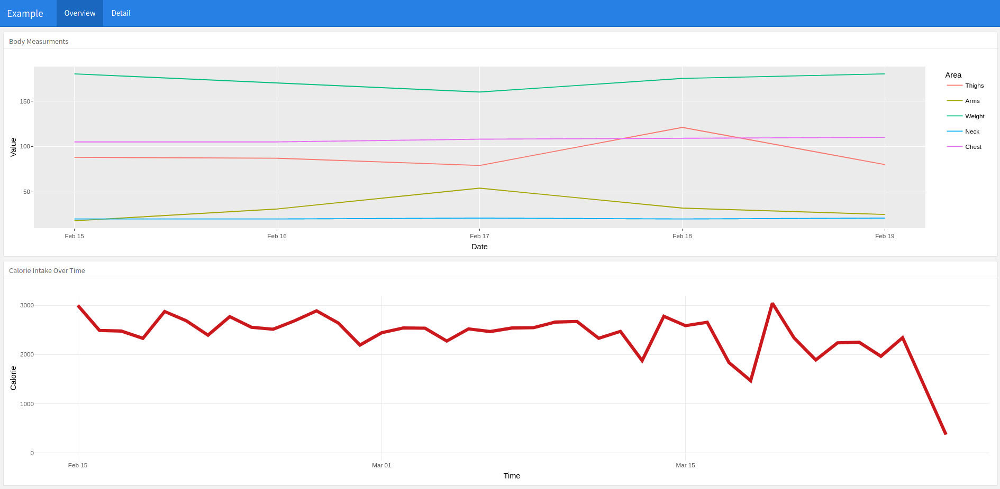
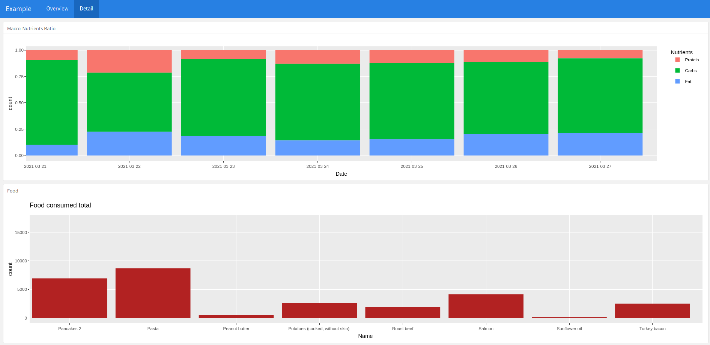

# foodMoniteur

Monitors Calorie Intake and Macronutrients Ratios in R using Flexdashboard and Plumber.

The Plumber worker listens to the `param` argument to read and wrangle the associated `.xlsx` file.
A flexdashboard HTML file is returned.

I advise to run this in a container.
A docker-compose yml document is available as an example.

To run from the publick Docker registry:

* `cd some_folder`
* `docker run -it --rm -p 80:80 -v $(pwd):/data ylanallouche/foodmoniteur`
* Browse: `http://localhost:81/dashboard?param=some_user`

